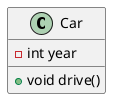

# Astro PlantUML Integration

This integration automatically converts PlantUML code blocks in your Markdown files to PNG images during the Astro build process.

## Installation

```bash
npm install astro-plantuml
```

## Usage

Add the integration to your `astro.config.mjs` file:

```js
import { defineConfig } from 'astro/config';
import astroPlantUML from 'astro-plantuml';

export default defineConfig({
  // Your existing config
  integrations: [
    astroPlantUML({
      // Options (all optional)
      serverUrl: 'http://www.plantuml.com/plantuml/png/', // PlantUML server URL
      timeout: 10000, // Timeout in milliseconds
      addWrapperClasses: true, // Add CSS classes to wrapper elements
      language: 'plantuml' // Language identifier to look for in code blocks
    })
  ],
});
```

## Using PlantUML in Markdown

Simply create code blocks with the `plantuml` language identifier:

```markdown
# My Document

Here's a class diagram:


```

The plugin will automatically convert these code blocks to PNG images during the build process.

## How It Works

1. The integration scans your Markdown files for code blocks with the `plantuml` language identifier
2. It sends the PlantUML code to a PlantUML server for rendering
3. The server returns a PNG image, which is embedded in your HTML
4. The original code block is replaced with the image in the final output

## Options

| Option | Type | Default | Description |
|--------|------|---------|-------------|
| `serverUrl` | string | `'http://www.plantuml.com/plantuml/png/'` | URL of the PlantUML server |
| `timeout` | number | `10000` | Timeout for HTTP requests in milliseconds |
| `addWrapperClasses` | boolean | `true` | Add CSS classes to wrapper elements |
| `language` | string | `'plantuml'` | Language identifier in code blocks to process |

## Running Your Own PlantUML Server

While the default public PlantUML server works for basic usage, you may want to run your own server for better performance and privacy:

### Using Docker

```bash
docker run -d -p 8080:8080 plantuml/plantuml-server:jetty
```

Then update your configuration to use your local server:

```js
astroPlantUML({
  serverUrl: 'http://localhost:8080/plantuml/png/'
})
```

## Styling

When `addWrapperClasses` is enabled, the following CSS classes are added:

- `.plantuml-diagram` on the wrapping `<figure>` element
- `.plantuml-img` on the `` element

You can use these classes to style the diagrams in your CSS:

```css
.plantuml-diagram {
  margin: 2rem 0;
  text-align: center;
}

.plantuml-img {
  max-width: 100%;
  height: auto;
}
```

## License

MIT