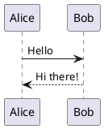
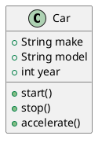
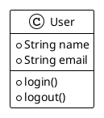
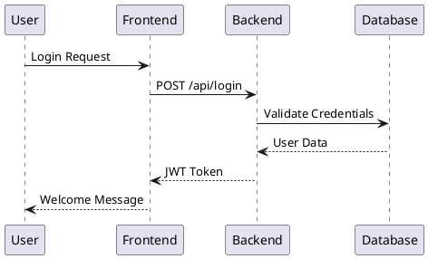
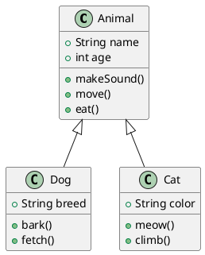
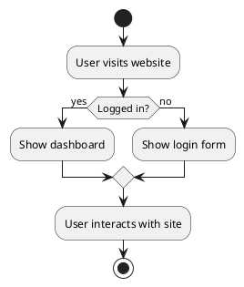

# astro-plantuml

An Astro integration for rendering PlantUML diagrams in your markdown files. This integration automatically converts PlantUML code blocks into beautiful diagrams using the PlantUML server.

## Demo Sites

- 🌐 **[Starlight Demo](https://astro-starlight-plantuml-demo.netlify.app/)** ([GitHub](https://github.com/joesaby/astro-starlight-plantuml-demo)) - Full documentation site using Starlight theme
- 🌐 **[Plain Astro Demo](https://astro-plantuml-demo.netlify.app/)** ([GitHub](https://github.com/joesaby/astro-plantuml-demo)) - Simple Astro site with PlantUML examples

## Features

- 🎨 Automatic conversion of PlantUML code blocks to images
- ⚡ Fast rendering using PlantUML's server
- 🎯 Customizable server URL and timeout settings
- 🎭 Optional CSS classes for styling
- 🔧 Configurable language identifier for code blocks
- 🌐 Support for custom PlantUML servers
- 📁 Local diagram generation and caching
- 🛠️ Built-in CLI tool for pre-generating diagrams
- 🖼️ Support for both SVG and PNG formats
- ✅ Astro 7 **Sätteri** markdown processor support (plus unified / legacy)

## Installation

```bash
npx astro add astro-plantuml
```

## Astro version compatibility

| Astro | Markdown engine | How PlantUML hooks in |
|-------|-----------------|----------------------|
| 7+ | Sätteri (`@astrojs/markdown-satteri`, the new default) | a Sätteri **mdast plugin** |
| 6.4 – 6.x | `unified()` processor | remark plugin via `markdown.processor` |
| < 6.4 / Astro 5 | legacy pipeline | top-level `markdown.remarkPlugins` |

If you previously pinned `markdown.processor` to `unified()` purely to keep PlantUML working on Astro 7, you can drop that workaround and let Astro use its default Sätteri processor.

To stay on unified deliberately:

```js
import { defineConfig } from 'astro/config';
import { unified } from '@astrojs/markdown-remark';
import plantuml from 'astro-plantuml';

export default defineConfig({
  markdown: {
    processor: unified(),
  },
  integrations: [plantuml()],
});
```

## Quick Start

Check out our demo sites to see various PlantUML diagrams in action!

## Usage

1. Add the integration to your `astro.config.mjs`:

```js
import { defineConfig } from 'astro/config';
import plantuml from 'astro-plantuml';

export default defineConfig({
  integrations: [plantuml()],
});
```

2. Use PlantUML in your markdown files:

```markdown
# My Documentation

Here's a sequence diagram:


```plantuml
@startuml
Alice -> Bob: Hello
Bob --> Alice: Hi there!
@enduml
```

And here's a class diagram:


```plantuml
@startuml
class Car {
  +String make
  +String model
  +int year
  +start()
  +stop()
  +accelerate()
}
@enduml
```

You can also use different themes:


```plantuml
@startuml
!theme plain
class User {
  +String name
  +String email
  +login()
  +logout()
}
@enduml
```

## Diagram Generation Workflows

The integration supports two main workflows:

### 1. Server-Only Mode (Default)
Diagrams are generated on-demand from the PlantUML server during build time:

```js
plantuml({
  serverUrl: 'https://www.plantuml.com/plantuml/svg/',
  format: 'svg'
})
```

### 2. Local File Mode with Fallback
Pre-generate diagrams during development, then use cached files during production builds:

```js
plantuml({
  serverUrl: 'http://localhost:8080/svg/', // Local server for development
  format: 'svg',
  diagramsPath: 'diagrams' // Enable local file lookup
})
```

## Pre-generating Diagrams

Use the built-in CLI tool to generate diagrams ahead of time. The CLI accepts explicit options, making it independent of your Astro configuration:

### Command Line Usage

```bash
# Generate diagrams for all markdown files (SVG format, public server)
npx astro-plantuml generate

# Generate for specific files/patterns
npx astro-plantuml generate "src/pages/**/*.md"
npx astro-plantuml generate "docs/*.md"

# Generate PNG format with local server
npx astro-plantuml generate --format png --server http://localhost:8080/png/

# Generate with custom output directory
npx astro-plantuml generate --output diagrams --format svg

# Full options example
npx astro-plantuml generate "src/**/*.md" --format png --server http://localhost:8080/png/ --output diagrams --timeout 15000
```

### CLI Options

- `--format FORMAT` - Output format (svg, png) [default: svg]
- `--server URL` - PlantUML server URL [default: https://www.plantuml.com/plantuml/svg/]
- `--output PATH` - Output directory [default: diagrams]  
- `--timeout MS` - Request timeout in milliseconds [default: 10000]

**Note:** The CLI options are independent of your Astro integration configuration, giving you full control over diagram generation.

### Integration with Build Tools

**Package.json Scripts:**
```json
{
  "scripts": {
    "generate-diagrams": "astro-plantuml generate --format png --server http://localhost:8080/png/",
    "generate-diagrams:prod": "astro-plantuml generate --format svg",
    "prebuild": "npm run generate-diagrams:prod"
  }
}
```

**Git Hooks (`.git/hooks/pre-commit`):**
```bash
#!/bin/sh
echo "Generating PlantUML diagrams..."
npx astro-plantuml generate --format png --server http://localhost:8080/png/
git add diagrams/
```

**GitHub Actions:**
```yaml
- name: Generate PlantUML diagrams
  run: npx astro-plantuml generate --format svg --output diagrams
```

**Docker/CI environments:**
```bash
# Use public server in environments without local PlantUML server
npx astro-plantuml generate --format svg --server https://www.plantuml.com/plantuml/svg/
```

## Configuration

You can configure the integration with the following options:

**With a PlantUML server:**

```js
plantuml({
  // URL of the PlantUML server (default: 'http://www.plantuml.com/plantuml/png/')
  serverUrl: 'https://your-custom-plantuml-server.com/plantuml/png/',
   
  // Timeout for HTTP requests in milliseconds (default: 10000)
  timeout: 10000,
  
  // Whether to add CSS classes to wrapper elements (default: true)
  addWrapperClasses: true,
  
  // Language identifier in code blocks (default: 'plantuml')
  language: 'plantuml'
})
```

**Using pre-generated diagrams for prod builds:**

```js
plantuml({
  // URL of the PlantUML server (default: 'http://www.plantuml.com/plantuml/svg/')
  serverUrl: 'https://your-custom-plantuml-server.com/plantuml/svg/',
  
  // Expected image format, either PNG or SVG
  format: 'svg', 
   
  // Path for storing/reading pre-generated diagrams (default: undefined)
  // When set, enables local file lookup with server fallback
  diagramsPath: process.env.NODE_ENV === 'production' ? 'diagrams' : undefined,
  
  // Timeout for HTTP requests in milliseconds (default: 10000)
  timeout: 10000,
  
  // Whether to add CSS classes to wrapper elements (default: true)
  addWrapperClasses: true,
  
  // Language identifier in code blocks (default: 'plantuml')
  language: 'plantuml',
  
  // Remove inline styles from SVG for better CSS control (default: false)
  // Only applies when format is 'svg'
  removeInlineStyles: true
})
```

### Using a Custom PlantUML Server

By default, the integration uses the public PlantUML server. However, you can use your own PlantUML server by setting the `serverUrl` option. This is useful when you:

- Need better performance or reliability
- Want to avoid rate limits
- Need to use custom themes or styles
- Want to keep your diagrams private

Example using a custom server:

```js
plantuml({
  serverUrl: 'https://your-custom-plantuml-server.com/plantuml/png/',
  // ... other options
})
```

You can set up your own PlantUML server using:
- Docker: `docker run -d -p 8080:8080 plantuml/plantuml-server:jetty`
- Java: Run the PlantUML server JAR file
- Other deployment options as per PlantUML's documentation

### CSS Styling

When `addWrapperClasses` is enabled (default), the integration adds the following CSS classes:

- `plantuml-diagram`: Wrapper around the diagram
- `plantuml-img`: The actual image element (PNG format)
- `plantuml-svg`: The SVG element (SVG format)
- `plantuml-error`: Error message container

You can style these in your CSS:

```css
.plantuml-diagram {
  margin: 2rem 0;
  text-align: center;
}

.plantuml-img {
  max-width: 100%;
  height: auto;
  border: 1px solid #eee;
  border-radius: 4px;
}

.plantuml-svg {
  max-width: 100%;
  height: auto;
  border: 1px solid #eee;
  border-radius: 4px;
}

.plantuml-error {
  background: #fee;
  border: 1px solid #f99;
  padding: 1rem;
  border-radius: 4px;
  margin: 1rem 0;
}
```

## Examples

### Sequence Diagram

```plantuml
@startuml
participant User
participant Frontend
participant Backend
participant Database

User -> Frontend: Login Request
Frontend -> Backend: POST /api/login
Backend -> Database: Validate Credentials
Database --> Backend: User Data
Backend --> Frontend: JWT Token
Frontend --> User: Welcome Message
@enduml
```

### Class Diagram

```plantuml
@startuml
class Animal {
  +String name
  +int age
  +makeSound()
  +move()
  +eat()
}

class Dog {
  +String breed
  +bark()
  +fetch()
}

class Cat {
  +String color
  +meow()
  +climb()
}

Animal <|-- Dog
Animal <|-- Cat
@enduml
```

### Activity Diagram

```plantuml
@startuml
start
:User visits website;
if (Logged in?) then (yes)
  :Show dashboard;
else (no)
  :Show login form;
endif
:User interacts with site;
stop
@enduml
```

## Error Handling

If there's an error generating a diagram, the integration will:
1. Display an error message
2. Keep the original code block for reference
3. Add the `plantuml-error` class to the error container

## Changelog

### [0.2.0] - 2026-08-21
#### Added
- ✅ Astro 7 Sätteri markdown processor support via a native mdast plugin
- 🔌 Processor-aware registration: Sätteri → `mdastPlugins`, unified → `remarkPlugins`, legacy → top-level arrays
- 📦 Expanded `peerDependencies.astro` to `>=5.5.6`

#### Changed
- Shared PlantUML render helpers used by remark, Sätteri, and CLI paths

### [0.1.2] - 2024-01-26
#### Fixed
- 🐛 Fixed PlantUML rendering by switching from rehype to remark plugin
- 🚀 Plugin now processes code blocks before syntax highlighting
- 🔧 Fixed encoding issue with PlantUML server (using deflateRawSync instead of deflateSync)
- 🧹 Removed deprecated rehype plugin

#### Changed
- Remark plugin runs before Shiki to prevent language warnings

### [0.1.1] - 2024-01-25
#### Added
- 🎉 Initial release
- ✨ Basic PlantUML rendering functionality
- 🎨 Configurable options (serverUrl, timeout, addWrapperClasses, language)
- 📚 Support for all PlantUML diagram types
- 🔧 Error handling with fallback to original code block

### [0.1.0] - 2024-01-24
#### Added
- 🚀 Initial development version
- ⚡ Core integration with Astro
- 🎯 Basic PlantUML to image conversion

## Publishing

Releases are automated with [semantic-release](https://github.com/semantic-release/semantic-release) on pushes to `main` (see `.github/workflows/release.yml`).

### How it works

1. Merge a PR to `main` whose commits follow [Conventional Commits](https://www.conventionalcommits.org/)
2. The release workflow builds the package and runs `semantic-release`
3. If there are releasable commits (`feat`, `fix`, or breaking changes), it:
   - bumps the version
   - publishes to npm
   - creates a GitHub release and git tag

| Commit type | Release |
|-------------|---------|
| `fix:` | patch |
| `feat:` | minor |
| `feat!:` / `BREAKING CHANGE:` | major |
| `chore:`, `docs:`, `ci:`, `test:`, … | none |

**Do not** manually edit `version` in `package.json` — semantic-release owns it.

### npm Trusted Publishing (OIDC)

Publishing uses npm Trusted Publishing (workflow `id-token: write`), same as `astro-mermaid`. Configure the GitHub Actions publisher for this repo on https://www.npmjs.com/package/astro-plantuml — no `NPM_TOKEN` secret is required.

### First-time setup

npm currently has `0.1.4` published, but this repo has no matching git tags. Before the first automated release, create a baseline tag so the next `feat` becomes `0.2.0` instead of `1.0.0`:

```bash
git tag v0.1.4 6da433d   # commit before the Sätteri feat
git push origin v0.1.4
```

Then merge this pipeline (or run **Release and Publish** via `workflow_dispatch`).

## Demo

Visit our demo sites to see:
- Sequence diagrams
- Class diagrams
- Activity diagrams
- State diagrams
- Component diagrams
- Mind maps
- Gantt charts

## License

MIT
